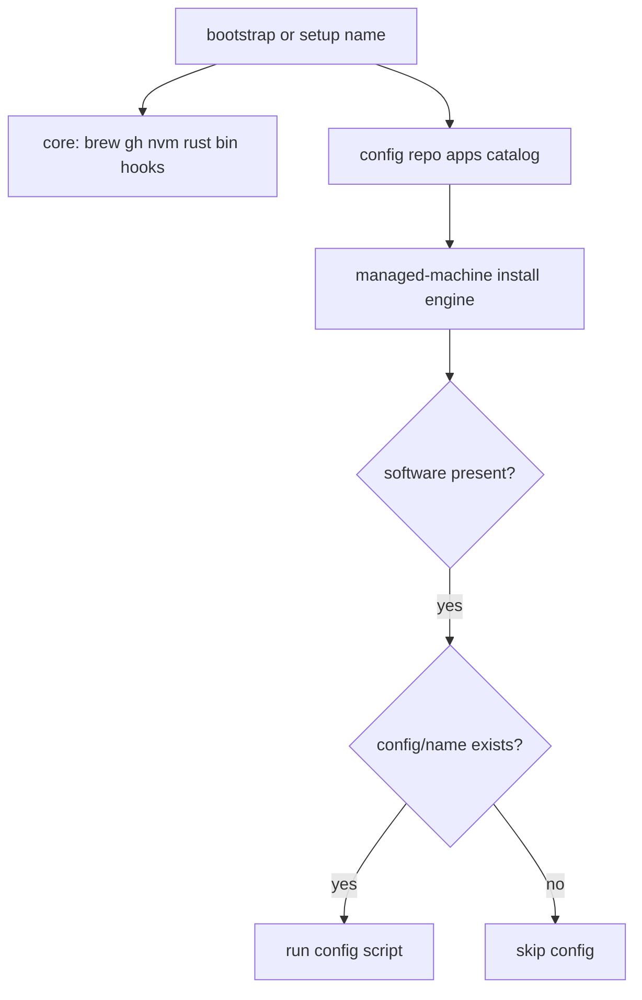

# Ownership, migrations, and config-driven apps

This machine already matches the intended layout: `[/opt/homebrew](/opt/homebrew)` is `admin:staff`, `[/Applications](/Applications)` is `root:admin` `775`, and `user` is not in the admin group. Current managed-machine would undo that: `[install.sh](install.sh)` `chown`s the prefix to `whoami`, and `[lib/cask-app.sh](lib/cask-app.sh)` / `[setup-lmstudio](setup-lmstudio)` fall back to `~/Applications` when `/Applications` is not writable.

Work spans **this repo** and **[qwts/managed-machine-config](https://github.com/qwts/managed-machine-config)** (`/Users/user/Code/managed-machine-config`). App *install* stays an engine in managed-machine. App *config* (zsh templates, Codex Muse merge, vscode argv, gitconfig, …) lives in the config repo and runs only when a script exists.




## 1. Homebrew stays owned by `admin`

Replace “prefix must be owned by the current user” with “preserve an admin-group owner; never steal it.”

- Preferred owner: user `admin` when that account exists and is in the `admin` group; otherwise the existing prefix owner if they are in `admin`. Record `brew_owner` in `~/.config/managed-machine/machine.toml` (local only).
- `[install.sh](install.sh)` `ensure_brew_ownership` and any setup path **must not** `chown -R $(whoami)` onto a prefix owned by an admin-group user. Old docs/skill text that tell you to run that `chown` go away.
- Fresh Homebrew: run the official installer **as the preferred owner** via Authorization Services → `sudo -u admin` (Homebrew refuses to run as root).
- Add `brew_run` in `[lib/install.sh](lib/install.sh)`: read-only `brew` as the current user; mutating `brew` (`install`, `upgrade`, `update`, cask adopt) runs as the prefix owner. Implementation: existing `[elevate_run](lib/elevate.sh)` wrapping `/usr/bin/sudo -u "$owner" /opt/homebrew/bin/brew ...`. Noninteractive bootstrap defers instead of prompting.
- Current user still *uses* brew (prefix is world-executable); they cannot write Cellar/Caskroom/python site-packages, which is the runtime boundary you want.

## 2. Desktop apps stay in `/Applications`

- `[resolve_cask_appdir](lib/cask-app.sh)` and LM Studio always choose `/Applications` unless an explicit `MANAGED_MACHINE_*_APPDIR` override is set. Delete the “not writable → `~/Applications`” fallback, including the adopt path that `mv`s bundles there.
- Installs go through `brew_run` as `admin`, who can write `/Applications` (`root:admin` `775`).
- Keep finding existing bundles in `~/Applications` so re-runs and migration can see old installs.

## 3. Migrations from older managed-machine

Run at the start of bootstrap and `--update`. Record applied IDs in `~/.config/managed-machine/migrations.manifest` (mode 600, never committed). Idempotent; skip when already applied or when the source layout is absent.

- `**brew-owner-v1**`: if the prefix is owned by the current *non-admin* user (the old installer), restore ownership to `admin` via one elevated `chown -R`. If it is already `admin`, no-op. Never chown *away* from `admin`.
- `**appdir-system-v1**`: for catalog casks (and LM Studio) that live in `~/Applications` with a Homebrew receipt, move the bundle to `/Applications` through elevation, then `brew_run install --cask --adopt --appdir=/Applications`. Skip if the app is running (same `lsof +D` rule as adopt). Do **not** touch unrelated `~/Applications` entries (Anaconda symlink, Brave Browser Apps).

CLI names keep working: `managed-machine setup vscode` / `setup-codex` / `setup-codex-cli` resolve through the catalog + aliases below.

## 4. Set macOS hostnames from hardware

Today `[register_current_machine](lib/fleet.sh)` snapshots `hostname -s` (often Apple’s `christophers-mac-mini`) and then freezes that string in the fleet record. Nothing ever runs `scutil --set`. Existing fleet names you already chose by hand (`MacbookPro16M2Pro`, `MacbookAir15M2`) show the intended scheme; new machines never get it.

Add core `**setup-hostname**` (machine identity, not a config-repo app). Run it **before** `setup-gh` so the first fleet registration stores the real name.

Detected short name, when hardware is readable:

- Product from `system_profiler SPHardwareDataType` Model Name: `MacBook Pro` → `MacbookPro`, `MacBook Air` → `MacbookAir`, `Mac mini` → `Macmini`, `Mac Studio` → `Macstudio`
- Size when a built-in display reports inches (e.g. `16-inch` in `SPDisplaysDataType`); omit rather than guess if missing (`MacminiM2`)
- Chip from Hardware `Chip` / `machdep.cpu.brand_string`: `Apple M2 Pro` → `M2Pro`, `Apple M4` → `M4`

Example: MacBook Pro, 16-inch, M2 → `MacbookPro16M2`

Then, via `[elevate_run](lib/elevate.sh)` (noninteractive defers):

```bash
scutil --set LocalHostName MacbookPro16M2
scutil --set ComputerName MacbookPro16M2
scutil --set HostName MacbookPro16M2.lan
```

Idempotent rules:

- Already matches detected values: no-op
- Looks like an Apple default (`X’s MacBook Pro`, `christophers-mac-mini`, `*.local` leftovers): replace
- Looks custom and does not match detection: leave it (do not clobber). Override with `MANAGED_MACHINE_HOSTNAME`
- Detection failure: skip/defer with a clear message; do not invent a name

`[register_current_machine](lib/fleet.sh)` should read `scutil --get LocalHostName` (not only `hostname -s`). After a successful set, refresh the fleet `hostname` field when it differs so `authorized_keys` comments and `machine.toml` stay aligned. Do not change `machine_id`.

## 5. Config repo: catalog + optional config scripts

**managed-machine-config** gains:

- A declarative catalog, e.g. `[apps.toml](https://github.com/qwts/managed-machine-config)` (or `apps/*.toml` if one file gets noisy). Each entry is policy only: name, kind, engine fields, aliases, bootstrap order. No install logic.
- Optional executable `[config/<name>](https://github.com/qwts/managed-machine-config)` scripts. After an engine reports the software is present, managed-machine runs that script **if it exists**; otherwise it skips. Scripts configure; they do not install.

Kinds the first catalog needs (engines stay in managed-machine; new *kinds* are a formula release):


| kind           | Engine                                                                                                            | First catalog entries                                        |
| -------------- | ----------------------------------------------------------------------------------------------------------------- | ------------------------------------------------------------ |
| `signed-cask`  | existing `[lib/cask-app.sh](lib/cask-app.sh)` allowlist moved into catalog rows (token, app name, Team ID, hosts) | vscode, cursor, claude-app, antigravity-app, antigravity-ide |
| `cask`         | Homebrew cask, no Team ID gate                                                                                    | lmstudio                                                     |
| `official-cli` | `[install_official_cli](lib/install.sh)` plus optional env (`CODEX_NON_INTERACTIVE`, `MUSE_NO_MODIFY_PATH`)       | claude, muse, antigravity, codex, proton-pass                |
| `opencode`     | current symlink-into-`~/.local/bin` behavior                                                                      | opencode                                                     |
| `devin`        | existing `[lib/devin.sh](lib/devin.sh)` install + auth deferral                                                   | devin                                                        |


**Core (stays in managed-machine, not catalog):** `setup-brew`, `setup-hostname`, `setup-nvm`, `setup-git-hooks`, `setup-gh`, `setup-bin`, `setup-rust`. These are machine functionality.

**Naming cleanup:** today’s `setup-codex` is config-only and `setup-codex-cli` is the installer. Catalog name `codex` installs the CLI; `config/codex` applies Muse Spark. Accept `codex-cli` as an alias. `managed-machine setup codex` becomes install-if-needed then config.

Move these into config scripts (today they live as setup-* in this repo, or as unwired `[dotfiles/](https://github.com/qwts/managed-machine-config)` trees):

- `config/zsh` — current `[setup-zsh](setup-zsh)` (`install_home_file` from `dotfiles/zsh`)
- `config/codex` — current `[setup-codex](setup-codex)` Muse merge (needs `codex` installed; if missing, skip or defer until the catalog installs it)
- Optional follow-through in the same config PR: wire existing unused templates (`dotfiles/vscode`, `git`, `vim`, `devin`, …) as `config/<name>` scripts. Only add scripts that are safe and idempotent; do not invent new live-home edits without using `install_home_file`.

Config scripts receive `CONFIG_REPO_ROOT` and `MANAGED_MACHINE_ROOT` and may `source "$MANAGED_MACHINE_ROOT/lib/install.sh"` for `install_home_file` / defer helpers. They must stay secret-free.

Parse the catalog with `python3` (already required for cask metadata). Keep the format boring so a missing/unknown `kind` fails closed and tells you it needs a managed-machine upgrade.

## 6. Bootstrap, CLI, formula, status

- `[scripts/bootstrap](scripts/bootstrap)`: core steps (`brew`, `**hostname**`, `nvm`, `git-hooks`, `gh`, `bin`, `rust`), then migrations, then catalog in declared order (engine then optional `config/<name>`), then any remaining `config/*` that are not tied to a catalog app (`zsh`). Drop the hardcoded `SETUP_SCRIPTS` app list.
- `[bin/managed-machine](bin/managed-machine)`: `setup <name>` resolves core scripts **or** catalog names/aliases; still rejects path traversal. Help lists both.
- `[Formula/managed-machine.rb](Formula/managed-machine.rb)`: install only core `setup-*`, `lib/`, `scripts/`, hooks. Stop listing every app script. That is what made “add ChatGPT” a formula release.
- `[scripts/status](scripts/status)`: core rows stay; app/CLI rows come from the catalog (command, cask token, app bundle). Missing catalog → those rows omitted, not hardcoded.
- `[scripts/update](scripts/update)`: still upgrades the formula + `setup-gh`/`setup-bin` (syncs config first), then reapplies catalog installs + config scripts that are safe/idempotent.

Adding ChatGPT later: one catalog row (and a `config/chatgpt` only if you need settings). No managed-machine tag.

## 7. Tests and docs

- Ownership: installer/setup never `chown`s to a non-admin `whoami`; `brew_run` uses `sudo -u admin` when the caller is not the owner; noninteractive defers.
- Appdir: unwritable `/Applications` no longer installs to `~/Applications`; tests that currently require that fallback (`[tests/setup-lmstudio.test.sh](tests/setup-lmstudio.test.sh)`, `[tests/adopt.test.sh](tests/adopt.test.sh)` move case) flip to elevate-as-owner / defer.
- Catalog: fixture config repo with two apps (one cask, one cli) + one config script; bootstrap order; missing script is skip; unknown kind fails closed.
- Migration: planted `~/Applications` cask + stolen prefix owner; second run is no-op.
- CLI aliases: `codex`, `codex-cli`, `vscode`.
- Hostname: fixture `system_profiler` / `scutil` stubs produce `MacbookPro16M2` + `.lan`; already-matching names skip elevation; custom names are left alone; noninteractive defers.
- Docs/skill: install no longer tells you to take `/opt/homebrew`; `/Applications` is the default; config repo owns the app list and optional config scripts; hostnames are derived from hardware via `scutil`.

Release a managed-machine version after this lands so Homebrew machines pick up the engines; then land the catalog + `config/zsh` + `config/codex` in managed-machine-config. This machine should not be bootstrapped until both are in place.